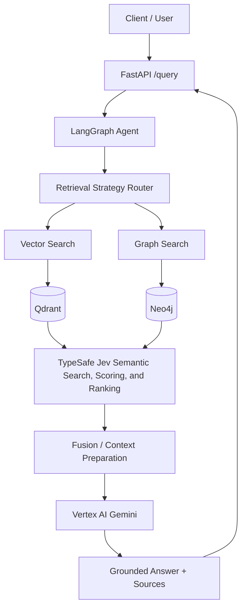

# Project Overview

## Agentic Graph RAG

Agentic Graph RAG is an intelligent Retrieval-Augmented Generation system that combines semantic vector retrieval, structured graph retrieval, and relevance reranking.

The system uses a LangGraph-based LLM agent to determine whether a query requires:

- Semantic vector retrieval
- Structured graph traversal
- Both retrieval strategies

Retrieved candidates are then scored for query relevance using **TypeSafe Jev**, fused when necessary, and passed to **Google Vertex AI Gemini** to generate a grounded answer with source references.

## TypeSafe Jev Capability Alignment

The Jev layer is designed around the search-and-retrieval capabilities documented by
TypeSafe: semantic search, query-to-candidate relevance scoring, pairwise result
reranking, cross-encoding for higher precision, and selecting useful context for
downstream AI workflows.

In this project, Jev is an optional query-time layer that can be used in several modes:

1. **Candidate scoring:** score each vector or graph-derived candidate against the user query.
2. **Pairwise ranking:** compare candidates when relative ordering is more useful than an isolated score.
3. **Cross-encoded precision pass:** apply a higher-precision query/candidate assessment to a bounded candidate set.
4. **Context selection:** retain the most useful evidence before sending context to Gemini.

The implementation should select the mode appropriate to the latency budget and evaluation
results. The initial MVP may begin with per-candidate scoring, while the interface should
allow pairwise ranking or cross-encoding to be introduced without changing the retrieval
providers.

## Why Vector + Graph + Jev?

Traditional vector RAG retrieves content based on embedding similarity. This works well for semantically similar questions but can struggle with explicit relationships and multi-hop queries.

Neo4j provides structured traversal over entities and relationships. However, graph traversal order alone does not necessarily represent relevance to the user's question.

TypeSafe Jev is used as a semantic search, scoring, and ranking layer. It can score query-to-candidate relevance, cross-encode queries and candidates for higher precision, support pairwise result comparisons, and select useful context before answer generation.

## Core Technologies

| Layer | Technology | Responsibility |
|---|---|---|
| API | FastAPI | Exposes the query endpoint |
| Agent orchestration | LangGraph | Controls query state and retrieval decisions |
| Reasoning / generation | Vertex AI Gemini | Query analysis, extraction, and grounded answer generation |
| Embeddings | Vertex AI | Creates document and query embeddings |
| Vector store | Qdrant | Stores and retrieves embedded document chunks |
| Graph store | Neo4j | Stores entities and relationships for traversal |
| Relevance scoring | TypeSafe Jev | Scores candidate relevance against the query |
| Evaluation | RAGAS | Evaluates retrieval and answer quality |
| Language | Python | Application and ETL implementation |
| Dependency management | uv | Reproducible Python environments |
| Local infrastructure | Docker Compose | Runs Neo4j and Qdrant locally |
| Testing | Pytest | Unit and integration testing |

## High-Level Architecture

## Main Objectives

- Build a production-oriented Graph RAG architecture.
- Combine vector and graph retrieval.
- Allow an LLM agent to select retrieval strategies dynamically.
- Use Jev to score candidate relevance independently of the main generation model.
- Support multi-hop relationship queries.
- Provide grounded answers with source attribution.
- Separate offline ingestion from query-time processing.
- Evaluate retrieval, reranking, and answer quality using offline datasets.
- Provide a FastAPI interface.
- Keep local infrastructure reproducible through Docker Compose.

## System Scope

### In Scope

- Document ingestion
- Document chunking
- Embedding generation
- Qdrant vector storage
- Entity and relationship extraction
- Neo4j graph construction
- Vector retrieval
- Graph retrieval
- Jev-based candidate reranking
- Result fusion
- LLM-based answer generation
- Source attribution
- API access
- Evaluation and testing

### Out of Scope

- Real-time document synchronization
- Multi-user authentication
- Fine-tuning Gemini or Jev
- Distributed Qdrant and Neo4j clusters
- Production-scale horizontal deployment
- Automatic knowledge graph correction
- Guaranteed correctness of extracted entities and relationships without validation

> **TypeSafe alignment note:** The Jev capabilities referenced here are based on the
> official TypeSafe search-and-retrieval use cases: semantic search, query-to-candidate
> relevance scoring, pairwise reranking, cross-encoding, and context selection.
> Implementation-specific SDK methods and response fields must be verified against the
> installed TypeSafe SDK version.
