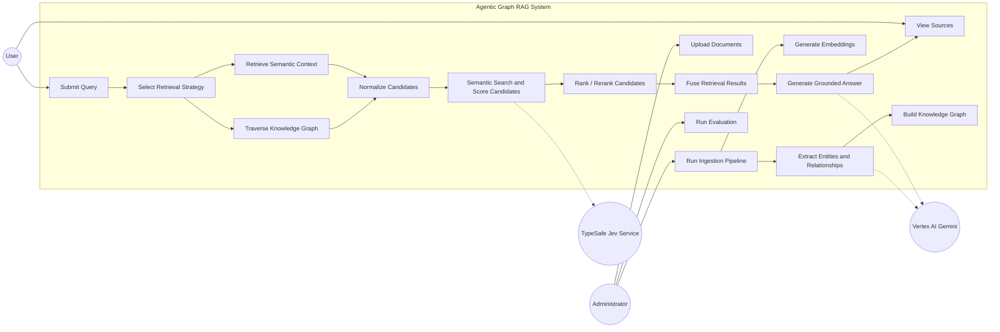

# Use Case Diagram

## Main Actors

- **User:** Submits questions and views grounded answers and sources.
- **Administrator:** Manages ingestion and evaluation workflows.
- **TypeSafe Jev Service:** Scores candidate relevance.
- **Vertex AI Gemini:** Supports agent reasoning, extraction, and answer generation.

> **TypeSafe alignment note:** The Jev capabilities referenced here are based on the
> official TypeSafe search-and-retrieval use cases: semantic search, query-to-candidate
> relevance scoring, pairwise reranking, cross-encoding, and context selection.
> Implementation-specific SDK methods and response fields must be verified against the
> installed TypeSafe SDK version.
