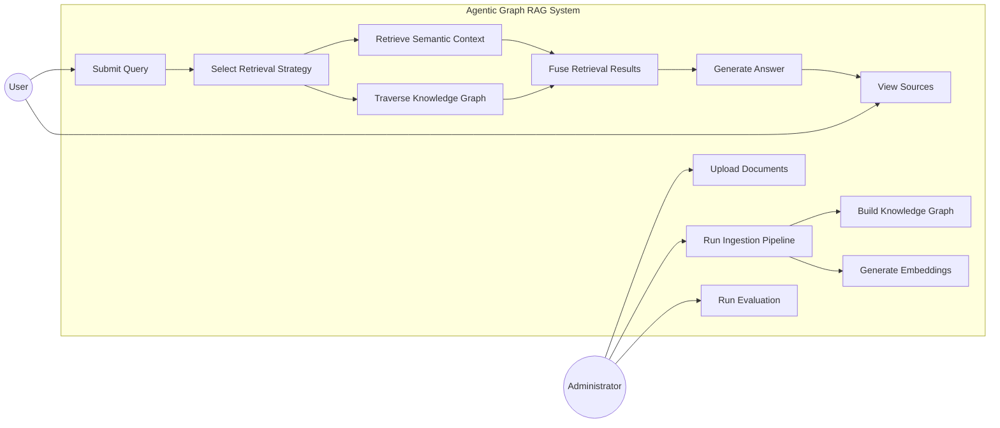

# Use Case Diagram


```mermaid
flowchart LR

    User((User))
    Admin((Administrator))

    subgraph Agentic Graph RAG System
        UC1[Submit Query]
        UC2[Retrieve Semantic Context]
        UC3[Traverse Knowledge Graph]
        UC4[Select Retrieval Strategy]
        UC5[Fuse Retrieval Results]
        UC6[Generate Answer]
        UC7[View Sources]

        UC8[Upload Documents]
        UC9[Run Ingestion Pipeline]
        UC10[Build Knowledge Graph]
        UC11[Generate Embeddings]

        UC12[Run Evaluation]
    end

    User --> UC1
    User --> UC7

    UC1 --> UC4
    UC4 --> UC2
    UC4 --> UC3
    UC2 --> UC5
    UC3 --> UC5
    UC5 --> UC6
    UC6 --> UC7

    Admin --> UC8
    Admin --> UC9
    UC9 --> UC10
    UC9 --> UC11
    Admin --> UC12
```
```mermaid

```