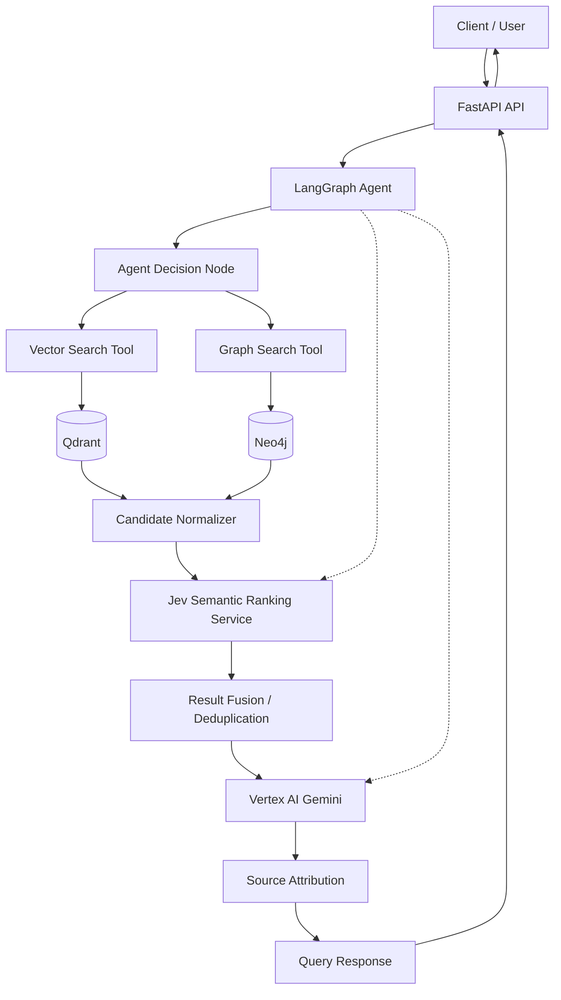

# Component Diagram

## Component Responsibilities

| Component | Responsibility |
|---|---|
| FastAPI API | Validates requests and returns responses |
| LangGraph Agent | Maintains workflow state and selects retrieval strategy |
| Vector Search Tool | Retrieves candidate chunks from Qdrant |
| Graph Search Tool | Retrieves graph facts from Neo4j |
| Candidate Normalizer | Converts different result types into a common format |
| Jev Semantic Ranking Service | Performs semantic scoring, pairwise ranking, cross-encoding, or context selection |
| Fusion | Combines, deduplicates, and prepares ranked context |
| Gemini | Generates grounded responses and supports extraction/reasoning |
| Source Attribution | Associates answer context with source metadata |

> **TypeSafe alignment note:** The Jev capabilities referenced here are based on the
> official TypeSafe search-and-retrieval use cases: semantic search, query-to-candidate
> relevance scoring, pairwise reranking, cross-encoding, and context selection.
> Implementation-specific SDK methods and response fields must be verified against the
> installed TypeSafe SDK version.
