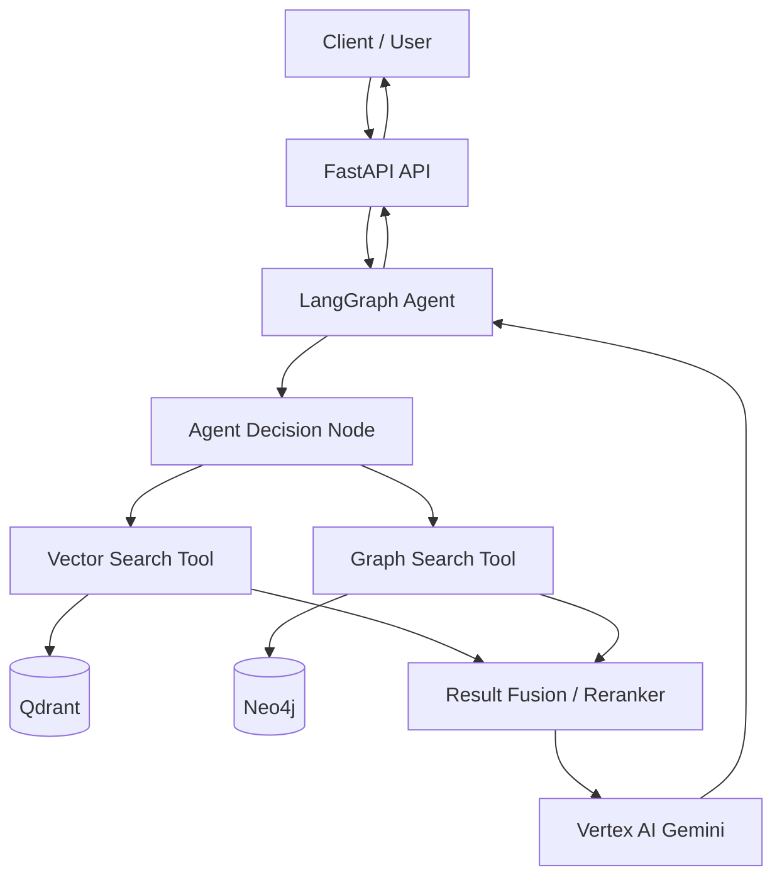

# Component Diagram

```mermaid
flowchart TB

    Client[Client / User]

    API[FastAPI API]

    Agent[LangGraph Agent]

    Router[Agent Decision Node]

    VectorTool[Vector Search Tool]
    GraphTool[Graph Search Tool]

    Qdrant[(Qdrant)]
    Neo4j[(Neo4j)]

    Fusion[Result Fusion / Reranker]

    Gemini[Vertex AI Gemini]

    Client --> API
    API --> Agent

    Agent --> Router

    Router --> VectorTool
    Router --> GraphTool

    VectorTool --> Qdrant
    GraphTool --> Neo4j

    VectorTool --> Fusion
    GraphTool --> Fusion

    Fusion --> Gemini
    Gemini --> Agent
    Agent --> API
    API --> Client
```