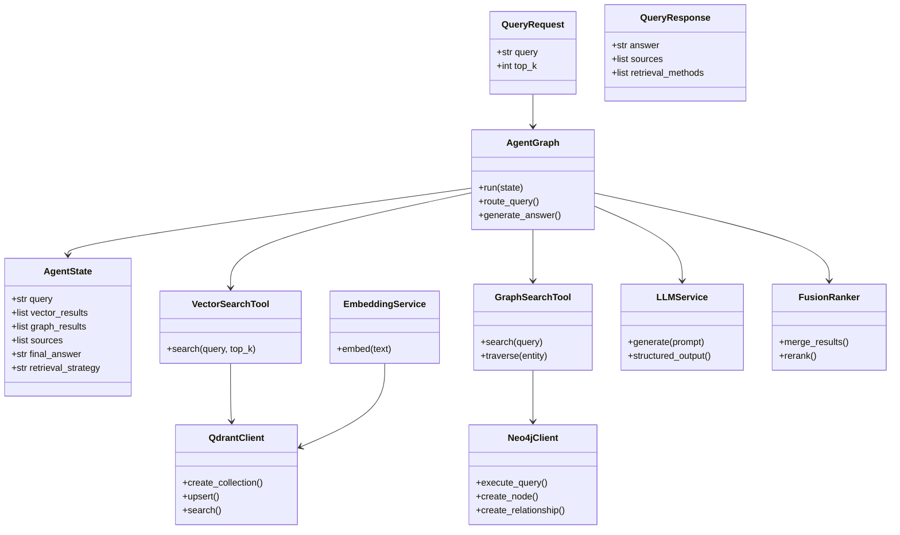

# class diagram

```mermaid
classDiagram

    class QueryRequest {
        +str query
        +int top_k
    }

    class QueryResponse {
        +str answer
        +list sources
        +list retrieval_methods
    }

    class AgentState {
        +str query
        +list vector_results
        +list graph_results
        +list sources
        +str final_answer
        +str retrieval_strategy
    }

    class VectorSearchTool {
        +search(query, top_k)
    }

    class GraphSearchTool {
        +search(query)
        +traverse(entity)
    }

    class QdrantClient {
        +create_collection()
        +upsert()
        +search()
    }

    class Neo4jClient {
        +execute_query()
        +create_node()
        +create_relationship()
    }

    class EmbeddingService {
        +embed(text)
    }

    class LLMService {
        +generate(prompt)
        +structured_output()
    }

    class FusionRanker {
        +merge_results()
        +rerank()
    }

    class AgentGraph {
        +run(state)
        +route_query()
        +generate_answer()
    }

    QueryRequest --> AgentGraph
    AgentGraph --> AgentState
    AgentGraph --> VectorSearchTool
    AgentGraph --> GraphSearchTool
    VectorSearchTool --> QdrantClient
    GraphSearchTool --> Neo4jClient
    AgentGraph --> FusionRanker
    AgentGraph --> LLMService
    EmbeddingService --> QdrantClient
```