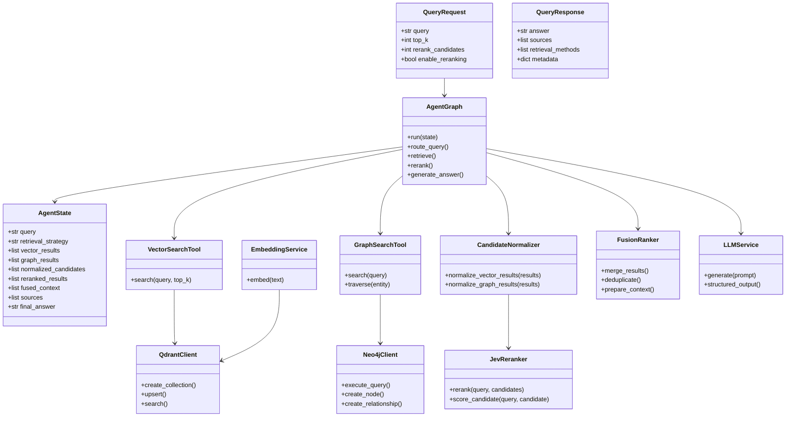

# Class Diagram

## Design Note

The exact class names and method signatures should be synchronized with the implementation once the project modules are created. The diagram represents the intended responsibility boundaries.

> **TypeSafe alignment note:** The Jev capabilities referenced here are based on the
> official TypeSafe search-and-retrieval use cases: semantic search, query-to-candidate
> relevance scoring, pairwise reranking, cross-encoding, and context selection.
> Implementation-specific SDK methods and response fields must be verified against the
> installed TypeSafe SDK version.
