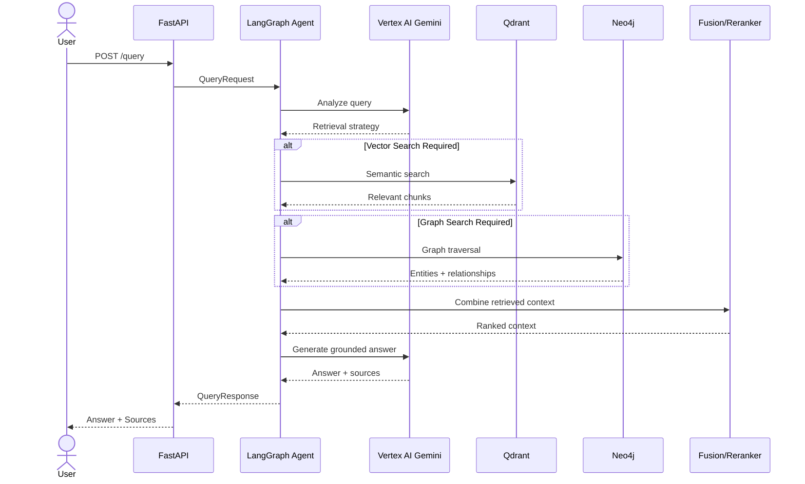

# sequence diagram

```mermaid
sequenceDiagram

    actor User
    participant API as FastAPI
    participant Agent as LangGraph Agent
    participant Gemini as Vertex AI Gemini
    participant Qdrant as Qdrant
    participant Neo4j as Neo4j
    participant Fusion as Fusion/Reranker

    User->>API: POST /query
    API->>Agent: QueryRequest

    Agent->>Gemini: Analyze query
    Gemini-->>Agent: Retrieval strategy

    alt Vector Search Required
        Agent->>Qdrant: Semantic search
        Qdrant-->>Agent: Relevant chunks
    end

    alt Graph Search Required
        Agent->>Neo4j: Graph traversal
        Neo4j-->>Agent: Entities + relationships
    end

    Agent->>Fusion: Combine retrieved context
    Fusion-->>Agent: Ranked context

    Agent->>Gemini: Generate grounded answer
    Gemini-->>Agent: Answer + sources

    Agent-->>API: QueryResponse
    API-->>User: Answer + Sources
```