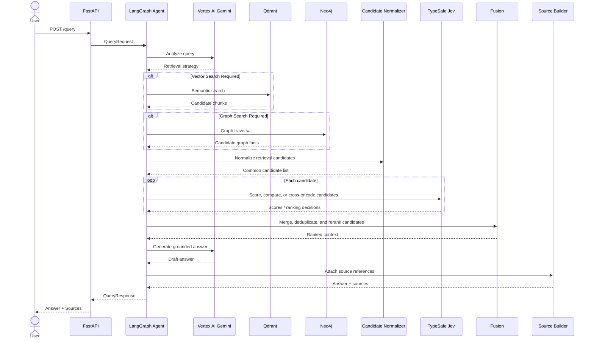

# Query Sequence Diagram

## Failure Path

If a Jev request fails, the system should log the error and apply a configured fallback. The fallback may preserve the provider score/order, omit the failed candidate from the selected context, or continue with partial results depending on the ranking mode. The exact fallback behavior should be covered by tests.

> **TypeSafe alignment note:** The Jev capabilities referenced here are based on the
> official TypeSafe search-and-retrieval use cases: semantic search, query-to-candidate
> relevance scoring, pairwise reranking, cross-encoding, and context selection.
> Implementation-specific SDK methods and response fields must be verified against the
> installed TypeSafe SDK version.
