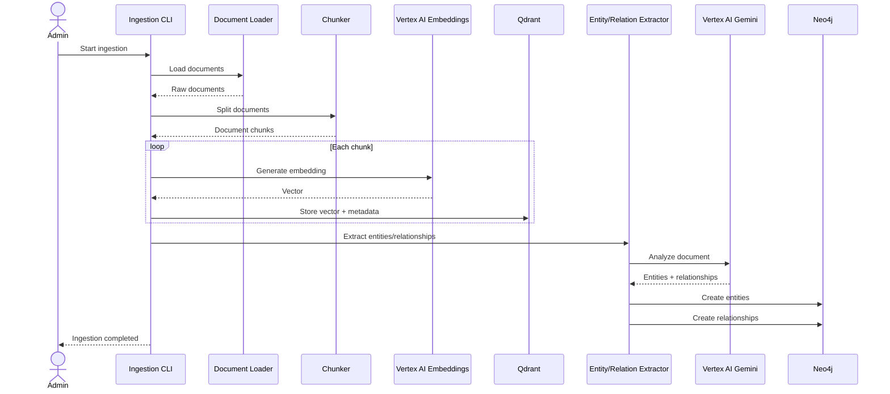

# ingestion sequence diagram

```mermaid
sequenceDiagram

    actor Admin
    participant CLI as Ingestion CLI
    participant Loader as Document Loader
    participant Chunker as Chunker
    participant Embedder as Vertex AI Embeddings
    participant Qdrant as Qdrant
    participant Extractor as Entity/Relation Extractor
    participant Gemini as Vertex AI Gemini
    participant Neo4j as Neo4j

    Admin->>CLI: Start ingestion

    CLI->>Loader: Load documents
    Loader-->>CLI: Raw documents

    CLI->>Chunker: Split documents
    Chunker-->>CLI: Document chunks

    loop Each chunk
        CLI->>Embedder: Generate embedding
        Embedder-->>CLI: Vector
        CLI->>Qdrant: Store vector + metadata
    end

    CLI->>Extractor: Extract entities/relationships
    Extractor->>Gemini: Analyze document
    Gemini-->>Extractor: Entities + relationships

    Extractor->>Neo4j: Create entities
    Extractor->>Neo4j: Create relationships

    CLI-->>Admin: Ingestion completed
```