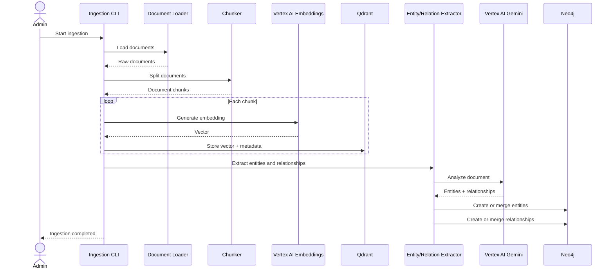

# Ingestion Sequence Diagram

## Reranking Note

Jev semantic search, scoring, and ranking are primarily query-time retrieval operations. It is not required for storing embeddings or constructing the initial knowledge graph. Ingestion should preserve sufficient text and source metadata so that retrieved vector chunks and graph-derived facts can later be scored by Jev.

> **TypeSafe alignment note:** The Jev capabilities referenced here are based on the
> official TypeSafe search-and-retrieval use cases: semantic search, query-to-candidate
> relevance scoring, pairwise reranking, cross-encoding, and context selection.
> Implementation-specific SDK methods and response fields must be verified against the
> installed TypeSafe SDK version.
