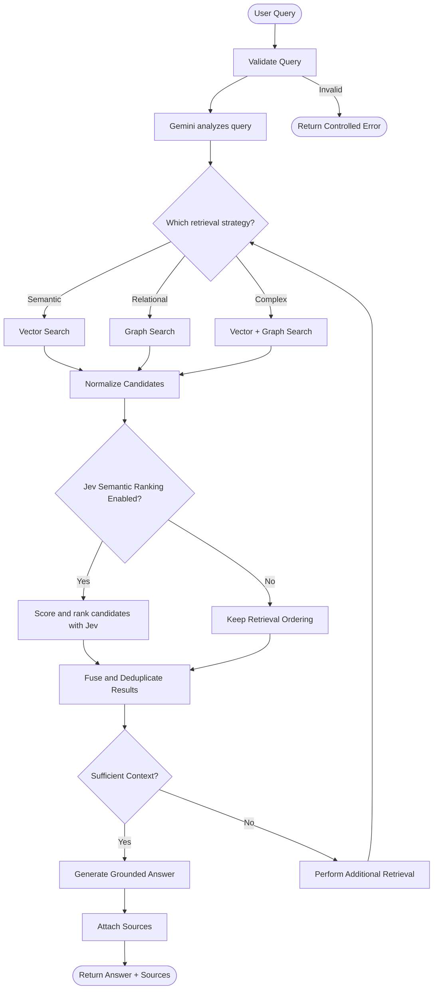

# Query Activity Diagram

## Activity Notes

- The agent chooses the retrieval path based on the query.
- Retrieval results are normalized before scoring.
- Jev semantic scoring/ranking is configurable and should be applied to a bounded candidate set.
- A Jev failure should use a configured fallback without unnecessarily terminating the whole request.
- If the available context is insufficient, the agent may perform additional retrieval or return a controlled insufficient-context response.

> **TypeSafe alignment note:** The Jev capabilities referenced here are based on the
> official TypeSafe search-and-retrieval use cases: semantic search, query-to-candidate
> relevance scoring, pairwise reranking, cross-encoding, and context selection.
> Implementation-specific SDK methods and response fields must be verified against the
> installed TypeSafe SDK version.
