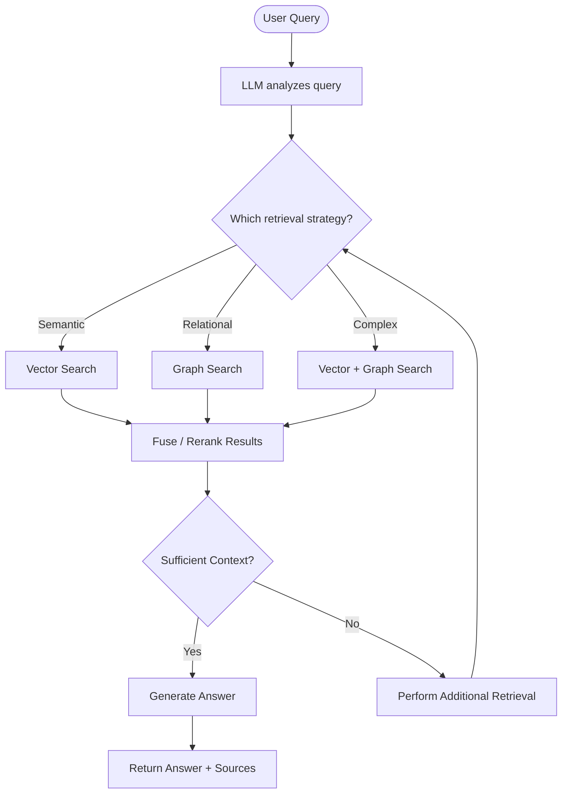

# activity diagram

```mermaid
flowchart TD

    Start([User Query])

    Analyze[LLM analyzes query]

    Decision{Which retrieval strategy?}

    Vector[Vector Search]
    Graph[Graph Search]
    Both[Vector + Graph Search]

    Fuse[Fuse / Rerank Results]

    Context{Sufficient Context?}

    Generate[Generate Answer]

    Retry[Perform Additional Retrieval]

    Response[Return Answer + Sources]

    Start --> Analyze
    Analyze --> Decision

    Decision -->|Semantic| Vector
    Decision -->|Relational| Graph
    Decision -->|Complex| Both

    Vector --> Fuse
    Graph --> Fuse
    Both --> Fuse

    Fuse --> Context

    Context -->|Yes| Generate
    Context -->|No| Retry

    Retry --> Decision

    Generate --> Response
```