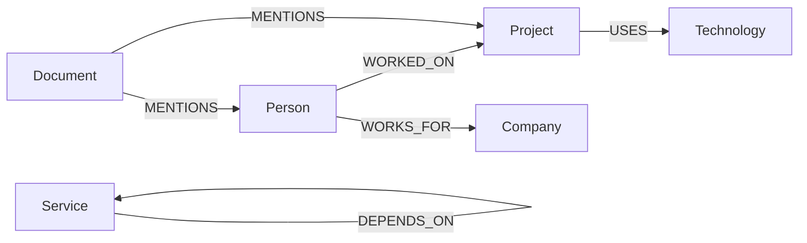

# Qdrant

Each vector point could contain:

    {
    "id": "chunk_001",
    "vector": [0.012, 0.034, "..."],
    "payload": {
        "document_id": "doc_001",
        "chunk_id": "chunk_001",
        "text": "....",
        "source": "architecture.md",
        "page": 4
    }
    }

Qdrant stores
    Embedding
    Chunk text
    Document ID
    Chunk ID
    Source
    Metadata

# Neo4j Graph Model

Define your graph schema explicitly.

For example:
    (:Person)
    (:Project)
    (:Company)
    (:Technology)
    (:Service)
    (:Document)

Relationships:

    (:Person)-[:WORKED_ON]->(:Project)

    (:Project)-[:USES]->(:Technology)

    (:Person)-[:WORKS_FOR]->(:Company)

    (:Service)-[:DEPENDS_ON]->(:Service)

    (:Document)-[:MENTIONS]->(:Person)

    (:Document)-[:MENTIONS]->(:Project)

