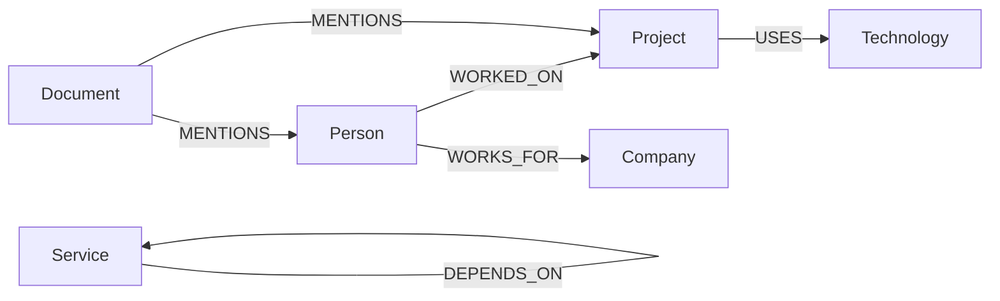
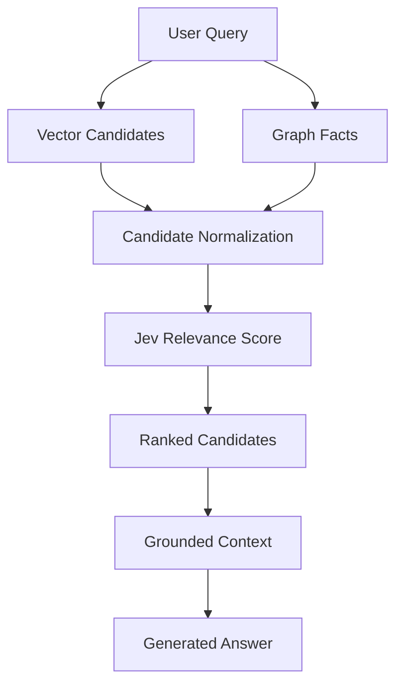

# Data Model

## Qdrant Vector Point

Each vector point should contain an embedding and payload metadata that allows the source chunk to be identified and reconstructed.

```json
{
  "id": "chunk_001",
  "vector": [0.012, 0.034, "..."],
  "payload": {
    "document_id": "doc_001",
    "chunk_id": "chunk_001",
    "text": "Relevant document text",
    "source": "architecture.md",
    "page": 4,
    "chunk_index": 0
  }
}
```

### Qdrant Stores

- Embedding vector
- Chunk text
- Document ID
- Chunk ID
- Chunk index
- Source
- Optional page and document metadata

## Common Retrieval Candidate

Vector and graph results should be converted into a common candidate representation before Jev scoring.

```json
{
  "candidate_id": "chunk_001",
  "source_type": "vector",
  "text": "Relevant document text",
  "document_id": "doc_001",
  "source": "architecture.md",
  "raw_score": 0.82,
  "rerank_score": 0.91
}
```

For a graph-derived candidate:

```json
{
  "candidate_id": "fact_001",
  "source_type": "graph",
  "text": "Project Alpha USES PostgreSQL",
  "entities": ["Project Alpha", "PostgreSQL"],
  "relationship": "USES",
  "raw_score": null,
  "rerank_score": 0.88,
  "source": "architecture.md"
}
```

`raw_score` may represent vector similarity when available. Graph traversal may not provide a comparable raw relevance score, so it can remain null. `rerank_score` is an optional semantic relevance score returned by Jev when the configured scoring mode produces a scalar score. Pairwise or ranking workflows may additionally produce comparison decisions, rank positions, confidence/probability fields, or selection metadata.

## Jev Semantic Search, Scoring, and Ranking

The intended relevance question is conceptually:

> Does this passage answer or directly support the query?

The candidate and query are sent to Jev using a typed question. The exact response accessor must be verified against the installed TypeSafe SDK version before implementation is finalized.

Recommended metadata:

- Query ID
- Candidate ID
- Reranking enabled flag
- Jev score, when available
- Scoring failure status, when applicable
- Reranking timestamp, if required
- Source metadata

Avoid storing sensitive document content in logs.

## Neo4j Graph Model

### Node Labels

```text
(:Person)
(:Project)
(:Company)
(:Technology)
(:Service)
(:Document)
```

### Relationships

```text
(:Person)-[:WORKED_ON]->(:Project)
(:Project)-[:USES]->(:Technology)
(:Person)-[:WORKS_FOR]->(:Company)
(:Service)-[:DEPENDS_ON]->(:Service)
(:Document)-[:MENTIONS]->(:Person)
(:Document)-[:MENTIONS]->(:Project)
```



## Data Flow




## Jev Ranking Metadata

The data model should remain extensible because TypeSafe documents several retrieval
patterns:

- Scalar query-to-candidate relevance scores.
- Pairwise comparison outcomes used to rerank results.
- Cross-encoded query/candidate assessments for higher precision.
- Context-selection decisions for downstream AI workflows.

Recommended optional fields include `ranking_mode`, `pairwise_wins`, `rank_position`,
`selection_reason`, and `confidence` where supported by the selected Jev question schema.
The exact field names and response accessors must be confirmed against the installed SDK
version before implementation.

> **TypeSafe alignment note:** The Jev capabilities referenced here are based on the
> official TypeSafe search-and-retrieval use cases: semantic search, query-to-candidate
> relevance scoring, pairwise reranking, cross-encoding, and context selection.
> Implementation-specific SDK methods and response fields must be verified against the
> installed TypeSafe SDK version.
